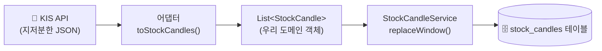
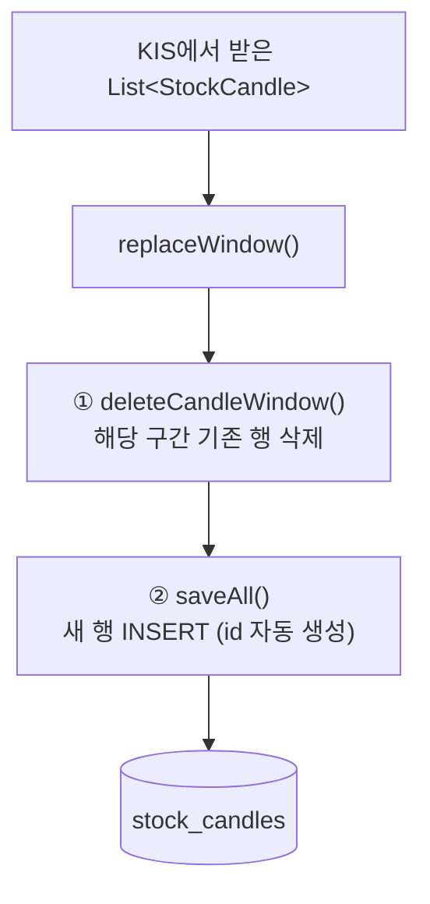
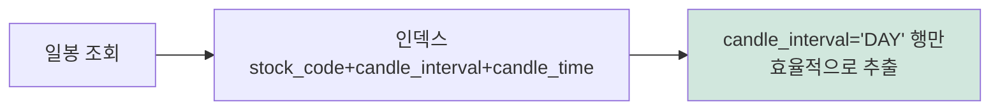
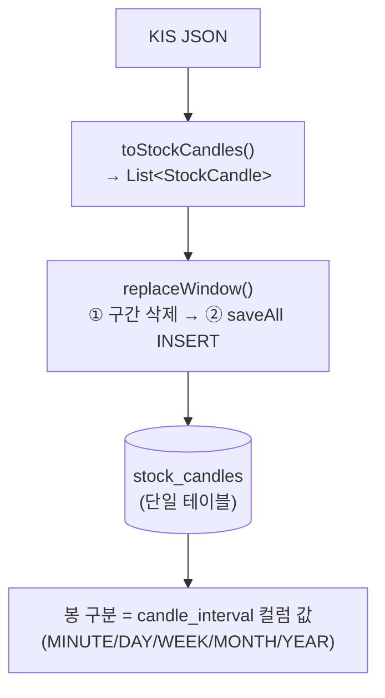

# 캔들 데이터는 DB에 어떻게 저장될까? (주니어용)

> 이 문서는 "KIS에서 받아온 캔들이 어떻게 DB에 들어가는지"와
> "왜 분/일/주/월/년봉을 **한 테이블**에 저장하는지"를 처음 보는 사람도
> 따라올 수 있게 의식의 흐름대로 풀어쓴 글입니다.

관련 코드
- 서비스: `src/main/java/com/tumo/stock/service/query/StockCandleService.java`
- 엔티티: `src/main/java/com/tumo/stock/domain/candle/StockCandle.java`
- 레포지토리: `src/main/java/com/tumo/stock/repository/StockCandleRepository.java`

---

## 1. 먼저 큰 그림 — 데이터는 어디서 와서 어디로 가나

우리 서버는 KIS(증권사)에서 캔들을 받아 **DB에 저장(캐시)** 해 둡니다.
같은 걸 또 요청하면 KIS를 다시 부르지 않고 DB에서 꺼내 주려고요.



핵심: **KIS JSON → `StockCandle` 객체 → DB 행(row)** 순서로 모양이 바뀝니다.

---

## 2. 저장 흐름 — 한 단계씩

### 2-1. KIS 응답을 우리 객체로 바꾼다

KIS는 숫자도 문자열로 주고(`"53000"`), 필드 이름도 약어(`stck_oprc`)입니다.
어댑터의 `toStockCandles()`가 이걸 **깔끔한 `StockCandle` 객체 리스트**로 번역합니다.
이때 각 객체에는 **봉 종류(interval), 시각, 시·고·저·종가, 거래량/대금**이 채워집니다.

### 2-2. 서비스가 DB를 보충한다

```java
private void replaceWindow(code, interval, fetchFrom, to, fetched) {
    stockCandleRepository.deleteCandleWindow(           // ① 먼저 비우고
            code, interval, fetchFrom.atStartOfDay(), to.atTime(LocalTime.MAX));
    stockCandleRepository.saveAll(fetched);             // ② 새로 채운다
}
```



### 2-3. 저장된 한 행의 모습

```
stock_candles
┌────┬────────────┬─────────────────┬─────────────────────┬──────┬──────┬──────┬───────┬────────┬────────┬────────────┐
│ id │ stock_code │ candle_interval │ candle_time         │ open │ high │ low  │ close │ volume │ amount │ created_at │
├────┼────────────┼─────────────────┼─────────────────────┼──────┼──────┼──────┼───────┼────────┼────────┼────────────┤
│ 11 │ 005930     │ DAY             │ 2025-01-02 00:00:00 │53000 │53800 │52600 │ 53400 │ 12.3M  │ 658B   │ ...        │
│ 12 │ 005930     │ DAY             │ 2025-01-03 00:00:00 │54000 │ ...  │ ...  │  ...  │  ...   │  ...   │ ...        │
└────┴────────────┴─────────────────┴─────────────────────┴──────┴──────┴──────┴───────┴────────┴────────┴────────────┘
```

---

## 3. 왜 "삭제 후 삽입"(delete-then-insert)일까?

그냥 INSERT만 하면 안 될까요? 두 가지 이유로 **먼저 지우고 다시 넣습니다.**

1. **미완성 마지막 봉 갱신**
   장중에 저장한 "오늘 봉"은 아직 진행 중이라 종가가 가짜일 수 있습니다.
   나중에 다시 받아 **덮어쓰려면** 기존 행을 지우고 새로 넣는 게 가장 단순합니다.

2. **유니크 충돌 회피**
   `(종목, 봉종류, 시각)`이 유일(unique)하도록 막아놨기 때문에,
   같은 시각을 또 INSERT하면 제약 위반이 납니다. 먼저 지우면 충돌이 없습니다.

> `deleteCandleWindow`는 `@Modifying` **벌크 삭제**라 즉시 실행되어,
> 같은 트랜잭션의 후속 INSERT와 부딪히지 않습니다.

---

## 4. 가장 헷갈리는 질문 — 왜 다섯 봉을 한 테이블에?

분봉 테이블, 일봉 테이블... 따로 만들어야 할 것 같은데 왜 하나일까요?
**답: 다섯 봉의 "데이터 모양(구조)"이 완전히 똑같기 때문입니다.**

### 이유 ① 컬럼이 100% 동일

분봉이든 년봉이든 한 캔들은 **항상 같은 항목**을 가집니다.

```
종목코드 · 시각 · 시가 · 고가 · 저가 · 종가 · 거래량 · 거래대금
```

다른 건 딱 하나, **"무슨 단위 봉이냐"** 뿐. 그건 **구조가 아니라 '값'** 입니다.
그래서 컬럼 하나(`candle_interval`)로 표현하면 충분합니다.

> 테이블을 5개로 쪼개면 똑같은 스키마를 **5번 복붙**하는 셈이라,
> 컬럼 하나 바꾸려면 5곳을 고쳐야 합니다(DRY 위반).

### 이유 ② 코드도 하나로 끝난다

| | 한 테이블 (현재) | 5개 테이블이라면 |
|---|---|---|
| 엔티티 | `StockCandle` 1개 | 5개 |
| Repository | 1개 | 5개 |
| 쿼리/서비스 | 1세트 | 5벌 (거의 복붙) |
| 새 봉 추가 | enum에 값 1개 추가 | 테이블+엔티티+레포 신규 생성 |

### 이유 ③ "봉별 분리"는 인덱스가 해준다

물리적으로 한 테이블이어도, 모든 쿼리가 `WHERE candle_interval = 'DAY'`로 거르고
복합 인덱스 `(stock_code, candle_interval, candle_time)` 가 이를 빠르게 처리합니다.



→ **논리적으로는 봉별로 분리된 것처럼** 동작하므로 물리 분리가 불필요합니다.

### 비유로 한 번에

```
❌ 학년마다 테이블: grade1_students, grade2_students, grade3_students ...
✅ 한 테이블 + 컬럼: students 테이블 + grade 컬럼
```

**"학년"은 학생의 한 속성(값)이지 구조를 바꾸지 않습니다.**
봉의 "분/일/주/월/년"도 똑같이 캔들의 한 속성일 뿐이라
`candle_interval` **컬럼 값**으로 두는 게 정석입니다.

### 유니크 제약이 이 설계를 받쳐준다

```java
uniqueConstraints = @UniqueConstraint(
    columnNames = {"stock_code", "candle_interval", "candle_time"})
```

`(종목, 봉종류, 시각)` 세 개가 합쳐져야 유일하므로,
**같은 종목·같은 시각이라도 봉 종류가 다르면 다른 행**으로 공존합니다.
(예: `2025-06-16`의 DAY 봉과 WEEK 봉이 충돌 없이 함께 저장됨)

---

## 5. 그럼 언제 테이블을 나누나?

지금은 안 나누는 게 맞지만, 아래 상황이면 분리를 고려합니다.

| 상황 | 대응 |
|------|------|
| 분봉이 일봉의 **수백 배**로 쌓여 성능 격리가 필요 | `candle_interval` 기준 **파티셔닝** 또는 분봉 전용 테이블 |
| 봉마다 **컬럼이 달라짐**(구조가 다름) | 테이블 분리가 정답 — 단 현재는 동일 |
| 보존 정책이 다름(분봉은 30일만 보관 등) | 파티션별 TTL/삭제 |

→ 현재 MVP는 **단일 테이블 + 복합 인덱스**로 충분하고,
데이터가 커지면 **코드 변경 없이 파티셔닝**으로 확장할 수 있습니다.

---

## 6. 한 장 요약



- 저장은 **delete-then-insert** — 미완성 봉 갱신 + 유니크 충돌 회피.
- 다섯 봉은 **구조가 같아서** 한 테이블에 두고, 봉 종류는 *구조가 아니라 값*이라
  `candle_interval` **컬럼**으로 구분한다.
- 봉별 분리는 **인덱스가 논리적으로** 해주므로 물리 분리는 불필요
  (데이터 폭증 시 파티셔닝으로 확장).
