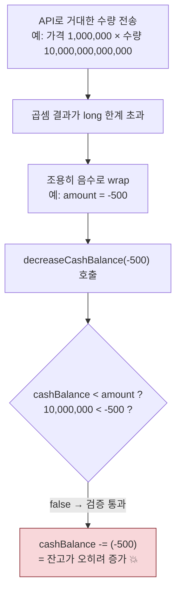
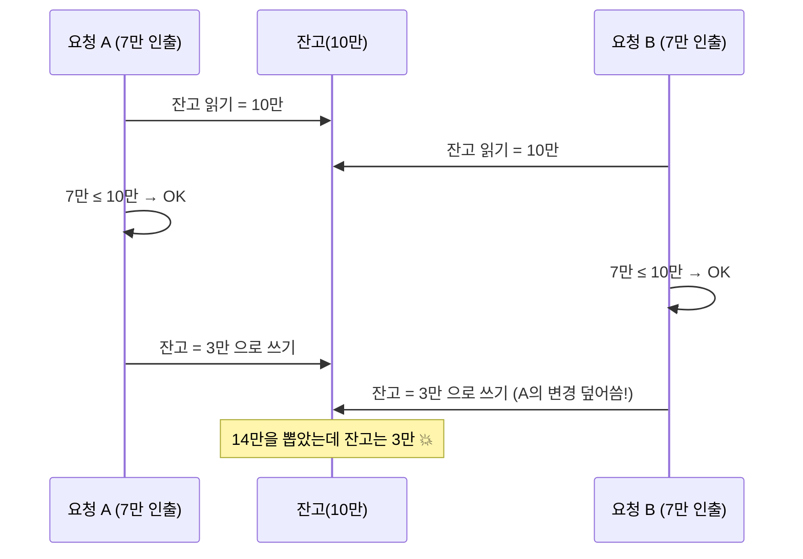
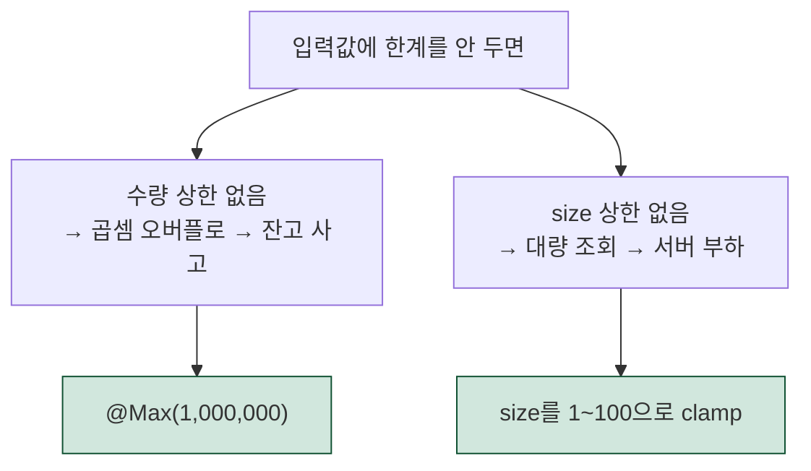

# 주문 기능, 코드 리뷰에서 무엇을 고쳤나? (주니어용)

> 매수/매도 주문 기능을 만든 뒤 코드 리뷰에서 **3가지 안전 문제**가 나왔습니다.
> 그중 **2개는 바로 고쳤고**(입력 한도), 1개(동시성)는 범위가 커서 별도 과제로 미뤘습니다.
> "왜 문제였고, 어떻게 막았는지"를 정리한 문서입니다.

관련 코드
- 수량 상한: `src/main/java/com/tumo/order/dto/OrderRequest.java` (`@Max`)
- 페이지 한도: `src/main/java/com/tumo/order/service/OrderService.java` (`getOrders`, `MAX_PAGE_SIZE`)
- 금액 계산: `src/main/java/com/tumo/order/service/OrderService.java` (`buy`/`sell`), `src/main/java/com/tumo/order/domain/Order.java`
- 현금/보유 변경: `src/main/java/com/tumo/user/domain/User.java`, `src/main/java/com/tumo/holding/domain/Holding.java`

---

## 1. 한 줄 결론

> **"사용자가 보낼 수 있는 숫자에 위/아래 한계를 두지 않으면"** 곱셈이 넘쳐서 잔고가 깨지거나(오버플로),
> 한 번에 너무 많은 데이터를 퍼올려 서버가 휘청인다. → **입력값에 상한선을 그어 막았다.**

---

## 2. 문제 1 — 정수 오버플로 (Integer Overflow) 🔴

### 2-1. 비유로 이해하기

컴퓨터는 숫자를 **고정 크기 상자**에 담습니다. Java의 `long`은 약 **920경**(9.2 × 10¹⁸)까지만 담깁니다.
이걸 넘으면 **에러가 나지 않고**, 자동차 주행거리계가 `999999 → 000000`으로 넘어가듯
**조용히 한 바퀴 돌아 엉뚱한 값(심지어 음수)** 이 됩니다. 이게 무서운 이유는 **아무 경고 없이** 일어나기 때문입니다.

### 2-2. 어디가 문제였나

주문 금액은 `가격 × 수량`으로 계산합니다.

```java
Long totalAmount = executedPrice * request.quantity();
```

그런데 수량 검증에는 **하한(1주)만 있고 상한이 없었습니다.**

```java
@Min(value = 1)   // 최소 1주 — 그런데 최대는? 없음!
Long quantity;
```

앱 화면은 큰 수량을 막더라도, 누군가 **API를 직접 호출**하면 말도 안 되는 수량을 보낼 수 있습니다.

### 2-3. 실제로 터지는 시나리오



현금 차감 로직은 "잔고보다 크면 거절"인데, `amount`가 **음수**면 이 검사를 그냥 통과합니다.

```java
public void decreaseCashBalance(Long amount) {
    if (cashBalance < amount) throw INSUFFICIENT_CASH; // 음수 amount면 통과해버림
    this.cashBalance -= amount;                        // 음수를 빼면 → 잔고 증가
}
```

→ 오버플로 하나로 **공짜 주식 + 잔고 증가**라는 금융 사고가 가능했습니다.

### 2-4. 어떻게 고쳤나

`OrderRequest`의 `quantity`에 **상한선**을 추가했습니다.

```java
@Min(value = 1, message = "주문 수량은 1 이상이어야 합니다.")
@Max(value = 1_000_000, message = "주문 수량은 1,000,000 이하여야 합니다.")  // ✅ 추가
Long quantity,
```

**왜 통하나?** 컨트롤러의 `@Valid`가 **메서드 실행 전에** 요청을 검사합니다.
수량이 100만을 넘으면 **계산을 시작하기도 전에** `400 Bad Request`로 거절합니다.
100만 주 × 현실적인 주가는 `long` 한계 근처에도 못 가므로 오버플로가 **원천 차단**됩니다.

---

## 3. 문제 2 — 페이지 크기(size) 무제한 🟡

### 3-1. 어디가 문제였나

주문 내역 조회는 "한 페이지에 몇 건"을 `size`로 받습니다(기본 30). 그런데 **최댓값 제한이 없었습니다.**

```text
GET /api/v1/orders?size=1000000
```

이러면 DB가 **100만 건을 한꺼번에** 메모리로 끌어옵니다 → 쿼리 지연 → 메모리 폭증 → 최악엔 서버 다운.
도구 없이 **URL 하나로 서버를 괴롭히는 간단한 DoS**가 됩니다.

### 3-2. 어떻게 고쳤나

`getOrders()`에서 들어온 값을 **안전한 범위로 강제 조정(clamp)** 했습니다.

```java
private static final int MAX_PAGE_SIZE = 100;
...
int boundedPage = Math.max(page, 0);                          // 페이지는 0 이상
int boundedSize = Math.min(Math.max(size, 1), MAX_PAGE_SIZE);  // size는 1~100 사이
```

`Math.min`/`Math.max`로 가두는 원리를 숫자로 보면:

| 들어온 size | `max(size, 1)` | `min(…, 100)` | 최종 |
|------------|----------------|----------------|------|
| 1000000 | 1000000 | **100** | 100 |
| 0 | **1** | 1 | 1 |
| 30 | 30 | 30 | 30 (정상값은 그대로) |

`page`도 `max(page, 0)`으로 음수를 막았는데, **음수 페이지를 넘기면 `PageRequest.of`가 예외를 던지기** 때문입니다.

> **왜 `@Max` 대신 clamp?** 어노테이션 방식은 별도 검증 설정·예외 핸들러가 필요하지만,
> clamp는 코드 몇 줄로 끝나고 다른 조회 API와도 잘 맞습니다 (KISS — 단순한 게 최고).

---

## 4. 발견했지만 "보류"한 문제 — 동시성(Race Condition) ⚠️

### 4-1. 비유로 이해하기

잔고 10만 원인 **같은 통장**에서, 부부가 서로 다른 ATM에서 **동시에** 7만 원씩 뽑는다고 해봅시다.



우리 코드도 "**읽기 → 검사 → 쓰기**" 사이에 잠금장치가 없어, 동시 요청 시
현금 초과 지출·보유 수량 초과 매도가 일어날 수 있습니다.

### 4-2. 왜 지금 안 고쳤나

- 이건 **매도뿐 아니라 기존 매수에도 있던 구조적 한계**라, 제대로 고치려면
  `User`/`Holding`에 낙관적 락(`@Version`)을 넣고 충돌 시 재시도 전략까지 함께 손봐야 합니다.
- 모의투자 앱에서 한 사용자가 의도적으로 동시 요청을 쏘는 경우는 드물어,
  **신규 결함이 아닌 기존 한계**로 보고 **별도 하드닝 과제**로 분리했습니다.

> 나중에 고칠 때 방향: `@Version` 필드 추가 → 동시 수정 시 `OptimisticLockingFailureException` 발생 →
> 두 번째 요청은 **최신 데이터로 재시도**하게 만든다. (매수·매도 모두 적용)

---

## 5. 요약



| 문제 | 핵심 | 수정 | 상태 |
|------|------|------|------|
| 정수 오버플로 | 수량 상한이 없어 큰 곱셈이 음수로 wrap → 잔고 사고 | `@Max(1_000_000)` | ✅ 완료 |
| 페이지 무제한 | `size`가 커서 대량 조회 → 서버 부하 | `size`를 1~100으로 clamp | ✅ 완료 |
| 동시성 | 잠금이 없어 동시 주문 시 잔고/수량이 깨짐 | `@Version` 낙관적 락 (예정) | ⏸ 보류(별도 과제) |

- **교훈:** 사용자가 보내는 모든 숫자는 **위/아래 한계**를 정하자. 특히 **돈·수량 계산**은 오버플로를 항상 의심하자.
- 수정 후 단위 테스트 **16개 통과**, 커밋 `6368aa4`에 반영.
