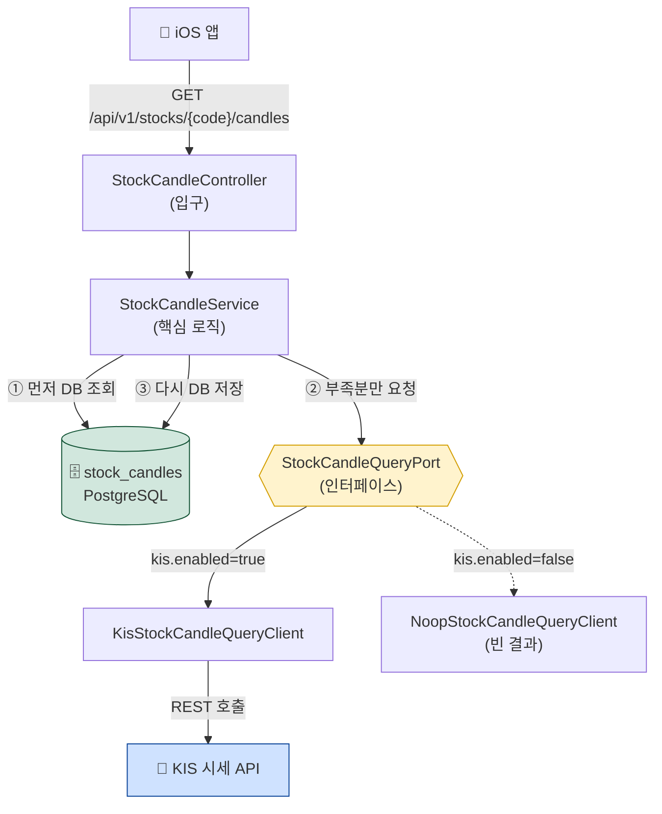
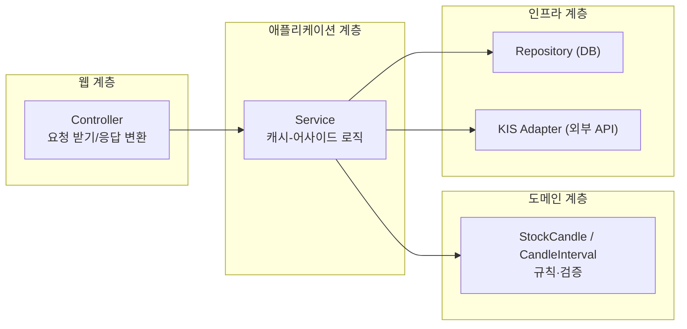
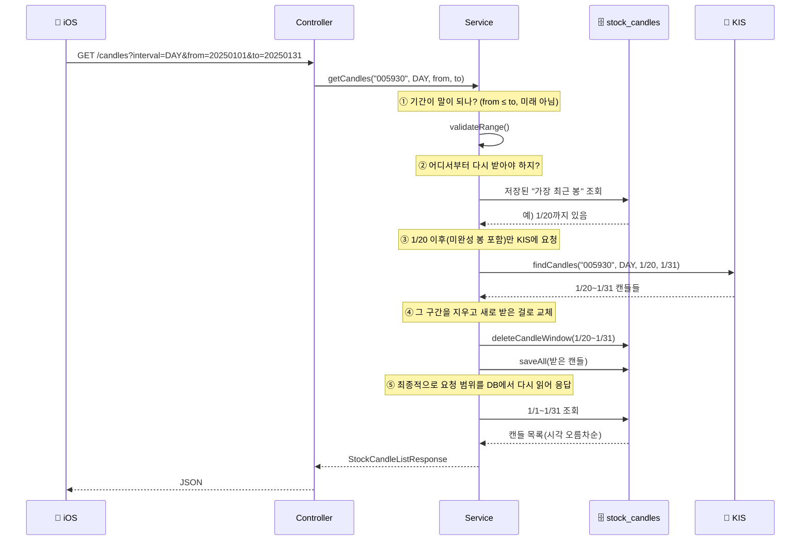
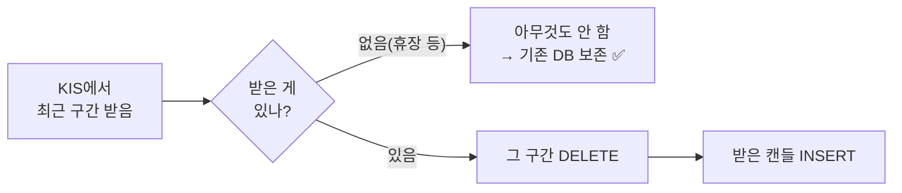
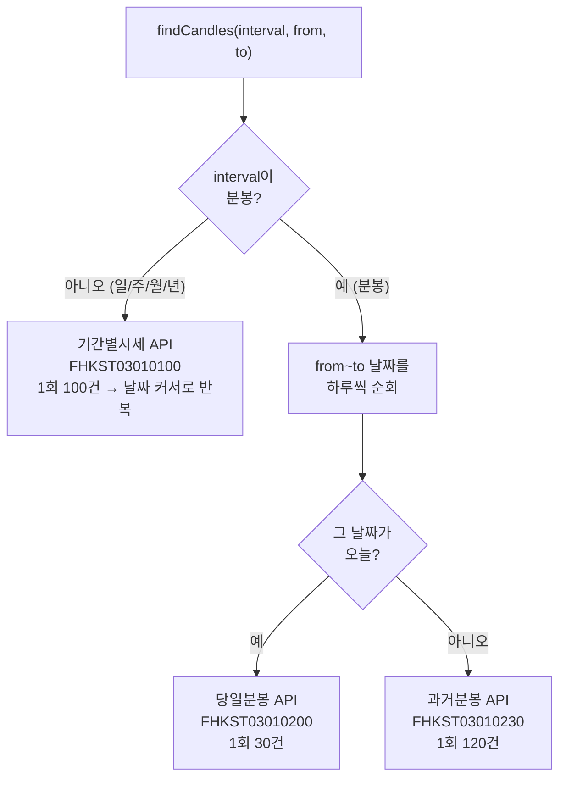
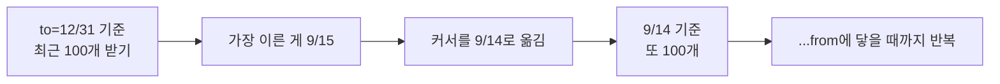
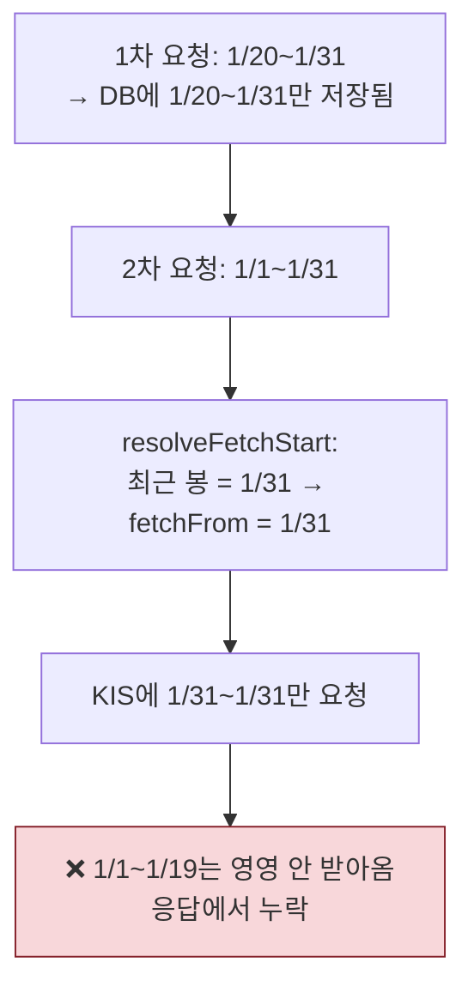
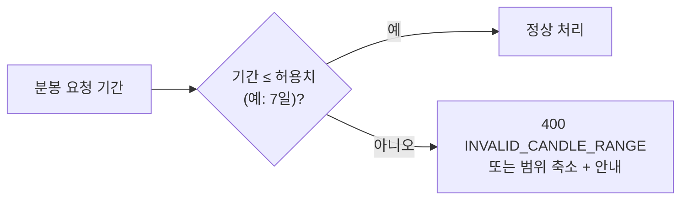
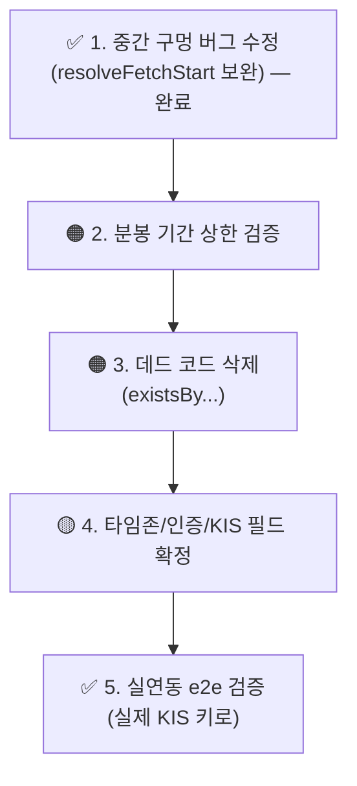

# 종목 차트(캔들) 기능 — 코드 리뷰 & 친절한 해설

> 대상: 분/일/주/월/년봉 차트 기능 (KIS 시세 API 래핑)
> 목적: ① 무엇을 어떻게 만들었는지 주니어도 이해하기, ② 코드 리뷰(좋은 점 / 고쳐야 할 점)

---

## 1. 한눈에 보기

iOS 앱이 "삼성전자 일봉 1년치 줘"라고 요청하면, 서버가 **DB에 저장된 캔들을 먼저 주고, 없는 부분만 KIS에서 받아와 채운 뒤** 합쳐서 돌려줍니다. KIS(한국투자증권)는 오직 **시세를 읽어오는 용도**로만 씁니다. 매수/매도는 이 기능과 전혀 상관없는 별개의 Tumo 로직입니다.

핵심 키워드 3개만 기억하세요:

| 키워드 | 뜻 | 왜? |
|--------|-----|-----|
| **캐시-어사이드(Cache-Aside)** | DB를 캐시처럼 쓰고, 없을 때만 원본(KIS)에서 가져옴 | KIS 호출 횟수↓ (rate limit 보호), 응답 속도↑ |
| **헥사고날(Port-Adapter)** | "무엇을 한다"(Port)와 "어떻게 한다"(Adapter)를 분리 | KIS를 가짜(Noop)로 바꿔 끼우기 쉬움 → 테스트 편함 |
| **delete-then-insert** | 갱신할 구간을 통째로 지우고 다시 넣음 | "오늘처럼 아직 안 끝난 봉"을 항상 최신으로 덮어쓰기 위함 |

---

## 2. 전체 구조 — 누가 누구를 부르나



**계층별 책임 (위 → 아래로 갈수록 "어떻게"에 가까워짐)**



> 💡 **주니어 포인트**: Service는 "KIS"라는 단어를 모릅니다. 오직 `StockCandleQueryPort`(인터페이스)만 압니다. 그래서 KIS를 Noop(가짜)으로 바꿔도 Service 코드는 한 줄도 안 바뀝니다. 이게 헥사고날의 핵심 이득입니다.

---

## 3. 요청 하나가 흘러가는 과정 (의식의 흐름)

"삼성전자(005930) 일봉, 2025-01-01 ~ 2025-01-31 줘"가 들어왔다고 합시다.



### 왜 "지우고 다시 넣나요?" (delete-then-insert)

오늘 장중이라면 **오늘 봉은 아직 안 끝났습니다.** 종가가 계속 바뀌죠. 그래서 "이미 저장돼 있으면 건너뛰기" 방식으로는 오늘 봉이 영영 옛날 값으로 남습니다. 그래서 "최근 구간은 통째로 지우고 새로 받은 값으로 덮어쓰기"를 택했습니다.



> 💡 `deleteCandleWindow`를 일반 JPA 삭제가 아니라 `@Modifying` **벌크 쿼리**로 만든 이유: 같은 트랜잭션에서 "삭제 → 삽입" 순서를 확실히 보장해, 유니크 제약(`stock_code+interval+candle_time`) 충돌을 피하기 위함입니다.

---

## 4. KIS 분기 — 봉 종류마다 API가 다르다

KIS는 봉 종류에 따라 **서로 다른 API 3개**를 씁니다. `KisStockCandleQueryClient`가 `interval`을 보고 길을 나눕니다.



### "날짜 커서로 반복"이 뭔가요? (페이지네이션)

KIS는 한 번에 최대 100건만 줍니다. 1년치 일봉(~250건)을 받으려면 끝에서부터 100개씩 끊어서 여러 번 불러야 합니다.



> 💡 **주니어 포인트**: 외부 API가 "1회 N건 제한"을 두는 건 흔합니다. 항상 "전체를 받으려면 어떻게 이어붙이지?"를 먼저 설계해야 합니다.

---

## 5. 코드 리뷰

전반적으로 **기존 '현재가 조회' 슬라이스의 패턴을 일관되게 따랐고, 계층 분리·검증·폴백·테스트가 갖춰져 있어 구조는 견고**합니다. 다만 캐시-어사이드 로직에 **실제 버그 하나**와 운영상 주의점이 있습니다.

### ✅ 잘된 점

- **일관성**: Port→Adapter, 요청/응답 record(`toKisRestRequest()`/`toStockCandles()`), Noop 폴백 등 기존 코드 관습을 그대로 따름 → 팀이 읽기 쉬움.
- **폴백 설계**: KIS 실패 시 예외를 던지지 않고 DB 보유분으로 대체(`log.warn` 후 진행). 기존 `StockService.refreshCurrentPrice()`와 동일 철학.
- **불변/검증**: `StockCandle` 생성자에서 음수가·null 방어, `record`로 응답 DTO 구성.
- **파싱 격리 + 테스트**: KIS 필드 매핑이 응답 record에 격리되고 단위 테스트가 있어, 실제 필드명이 달라도 그 파일만 고치면 됨.
- **무한 루프 방지**: 페이지네이션에 `MAX_PAGES` 상한.

### ✅ HIGH (수정 완료) — 캐시 "중간 구멍"은 채워지지 않는 버그

> **상태:** 커밋 `e038432` 이후 후속 커밋에서 수정됨. 아래는 원래 문제와 적용한 수정 내용.

`resolveFetchStart()`는 **"저장된 가장 최근 봉"** 하나만 보고 거기서부터 다시 받았습니다. 그래서 **DB에 저장된 데이터가 앞쪽부터 연속적이라고 암묵적으로 가정**합니다. 만약 중간이나 앞쪽이 비어 있으면 영영 안 채워집니다.

**재현 시나리오:**



즉, 사용자가 **좁은 범위를 먼저 본 뒤 넓은 범위를 보면** 앞부분이 비어서 나옵니다.

**적용한 수정:** 위 1번(가장 단순) 방향. `StockCandleRepository`에 `findTopByStockCodeAndIntervalOrderByCandleTimeAsc`(가장 이른 봉)를 추가하고, `resolveFetchStart`가 **저장된 가장 이른 봉이 `from`을 덮는지(앞쪽 커버 여부)** 를 먼저 판정하도록 바꿨습니다.

```java
private LocalDate resolveFetchStart(String stockCode, CandleInterval interval, LocalDate from) {
    boolean frontCovered = stockCandleRepository
            .findTopByStockCodeAndIntervalOrderByCandleTimeAsc(stockCode, interval)
            .map(earliest -> earliest.getCandleTime().toLocalDate())
            .map(earliestDate -> !earliestDate.isAfter(from))   // earliest <= from
            .orElse(false);

    if (!frontCovered) {
        return from;        // 앞쪽에 구멍(또는 저장 없음) → from부터 전체 재조회
    }
    return stockCandleRepository.findTopByStockCodeAndIntervalOrderByCandleTimeDesc(stockCode, interval)
            .map(latest -> latest.getCandleTime().toLocalDate())
            .filter(latestDate -> latestDate.isAfter(from))      // 앞쪽 커버 시 꼬리만 갱신
            .orElse(from);
}
```

- 회귀 테스트 `StockCandleServiceTest.refetchesFromStartWhenStoredFrontHasGap()` 추가 — 1/20부터만 저장된 상태에서 1/1~1/31 요청 시 `from(1/1)`부터 재조회하는지 검증.
- **잔여 한계(문서화됨):** 앞쪽이 채워진 상태에서 **서로 떨어진 저장 구간(중간 섬)**이 생기면 그 사이 구멍은 여전히 안 메워집니다. 차트 UI처럼 범위를 이어서 넓혀 보는 패턴에선 발생하지 않으며, 분리 구간을 따로 조회하는 케이스가 필요해지면 "요청 범위 전체 재조회"로 전환해야 합니다.

### 🟠 MEDIUM — 분봉의 무제한 기간 = KIS 폭탄

분봉은 `from~to`를 **하루씩 순회**하며 날마다 여러 번 호출합니다(당일 30건/과거 120건 한도). `from=20200101&to=20251231&interval=MINUTE`이 들어오면 **수천 번의 KIS 호출**이 발생해 rate limit을 넘기거나 요청이 멈춥니다.

- **제안**: 분봉에 한해 최대 기간을 검증(예: 분봉은 최근 N일까지만 허용)하고, 초과 시 `INVALID_CANDLE_RANGE`로 거절. 또는 응답에 "잘렸음"을 표시.



### 🟠 MEDIUM — 데드 코드

`StockCandleRepository.existsByStockCodeAndIntervalAndCandleTime(...)`는 **어디서도 호출되지 않습니다.** 초기엔 "중복이면 건너뛰기"용으로 넣었다가 delete-then-insert로 방향을 바꾸면서 남았습니다. → **삭제 권장.**

### 🟡 LOW — 그 외 점검거리

| 항목 | 내용 | 제안 |
|------|------|------|
| 타임존 | `LocalDate.now()`로 "오늘"을 판단 → 서버 TZ가 KST가 아니면 분봉 당일/과거 분기가 틀어짐 | 서버 TZ를 KST로 고정하거나 `Clock`/`ZoneId` 주입 |
| 동시성 | 같은 종목·interval에 동시 요청 시 delete→insert가 겹치면 충돌/유실 가능 | MVP는 허용. 추후 종목별 락 또는 upsert |
| `to` 미래값 | `from`만 미래 검증, `to`는 미검증 | 큰 문제는 없으나 `to`도 오늘로 clamp 고려 |
| 인증 | 새 엔드포인트가 Security 설정(`/api/v1/stocks/**`)에 어떻게 걸리는지 확인 필요 | 기존 종목 API와 동일 정책인지 확인 |
| KIS 필드명 | output2 필드명(`stck_oprc` 등)·레코드 한도는 best-known 값 | 실연동 전 KIS 개발자센터 문서로 확정 |

---

## 6. 우선순위 정리



---

## 7. 최종 체크리스트

- [x] **(필수)** 좁은 범위 → 넓은 범위 요청 시 앞부분이 채워지는지 검증 (HIGH 버그) — 수정 + 회귀 테스트 완료
- [ ] **(필수)** 분봉 장기간 요청 시 KIS 호출 폭증 방지 가드
- [ ] 사용하지 않는 `existsBy...` 메서드 제거
- [ ] 서버 타임존이 KST인지 확인 (분봉 "오늘" 판정)
- [ ] 새 엔드포인트의 인증/인가 정책 확인
- [ ] 실제 KIS 키로 일/주/월/년/분봉 응답·DB 적재·재요청 캐시 동작 e2e 확인
- [ ] (확장 시) 동시 요청 정합성, Redis 캐시 도입 검토

---

### 부록 — 한 줄 요약

> **"DB를 캐시로, KIS를 원본으로 쓰는 캔들 프록시."** 구조는 탄탄하지만, '저장 데이터가 앞에서부터 연속적'이라는 가정 때문에 **중간/앞쪽 구멍이 안 채워지는 버그**가 있으니 그것부터 고치면 됩니다.
